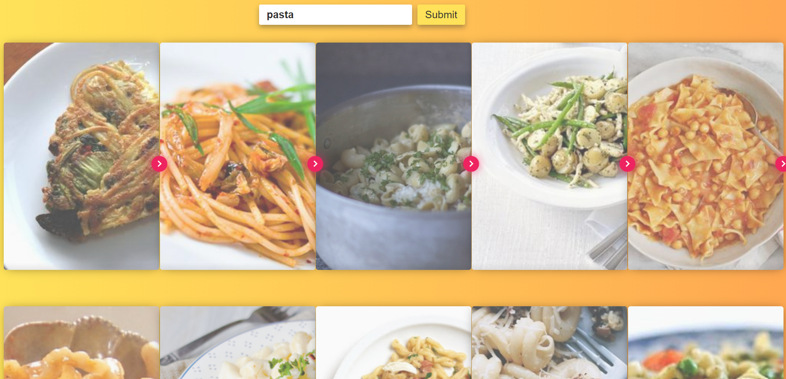
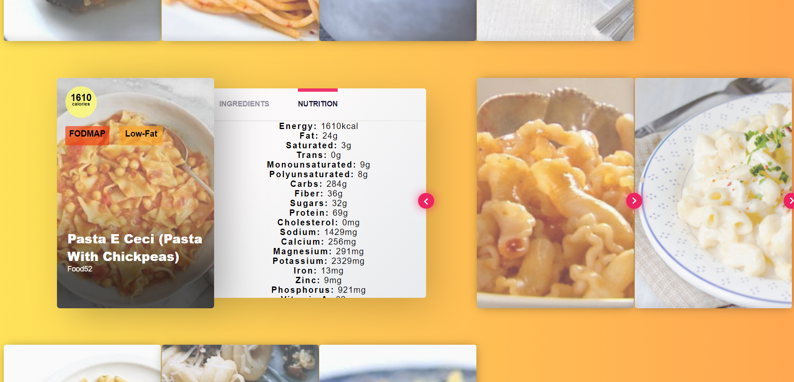

## Recipe App 🍔
this app search recipes based on user search

## 👨‍💻 Technologies used
1. SCSS -- for styling
2. React -- front end
3. Axios -- REST API integration

## How to Run ☸ this App
1. Install nodejs [Click here](https://nodejs.org/en/) LTS preffered
2. After installing nodejs go to project folder open terminal enter following command
```terminal
npm install
```
above command install all the the dependencies required for the app

3. Enter this command to start application
```terminal
npm start
```

4. after running this command go to browser and enter this link to open react application
```
http://localhost:3000
```
## Preview
1. Search UI


2. Item UI


